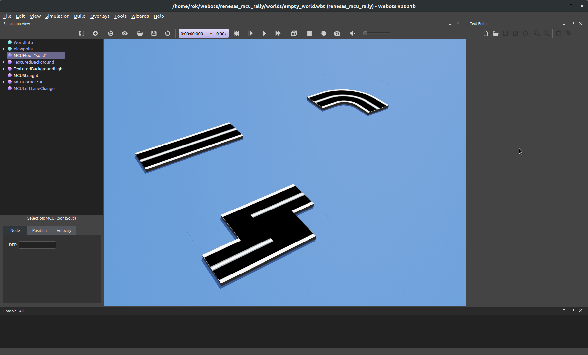

# Building tracks

Custom tracks can be built by using the provided assets.

Example use of track assets.

The assets contain tiles (1x1 m) that can be easily assembled into new configurations.

## Good practice

It is recommended to use a Group node (found under Base nodes) as the root node when building tracks. To add individual assets, Add Node, then navigate to PROTO nodes (Current Project) -> track_parts.

To save a track for later use, check the [PROTO manuals](https://cyberbotics.com/doc/reference/proto) in the WeBots documentation. Saving custom PROTO nodes involves opening the world definition in a text editor, copying the part with the track Group node to a .proto file, and placing the proto file into the protos folder of the project.
