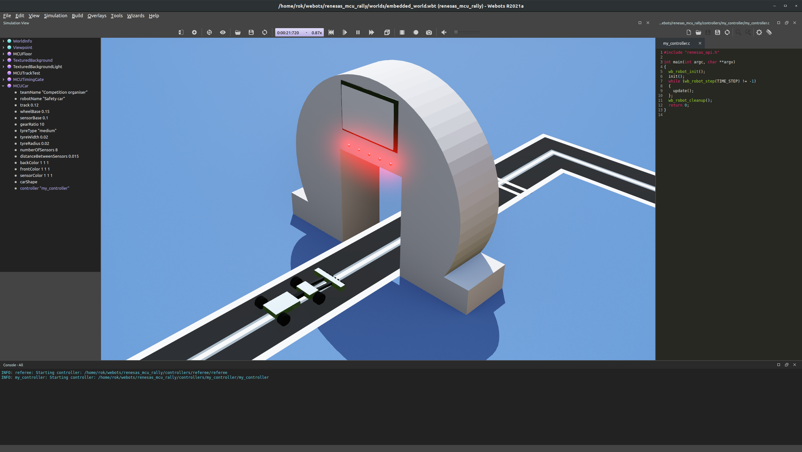

# Creating controllers

To program the MCU Robot, a custom controller needs to be created and compiled, and then, the robot needs to point to the newly created controller executable.

To create a your robot controller, use the WeBots menu: Wizards -> New Robot Controller. Use C as the controller language. Name the controller, however you want. In this example, the name will be `my_controller`.

WeBots creates a new folder within the controllers folder of the project and two files:

- my_controller.c: The source code for the controller, to be modified.
- Makefile: The instructions for compiling the controller, to be edited once.

## Modify the Makefile

Find the Makefile in the my_controller folder and modify the section before the "do not mofify" tag to include `C_SOURCES` and `INCLUDE` path definition. Make sure that you rename my_controller.c to the name you chose for your controller.

```make
###-----------------------------------------------------------------------------

C_SOURCES = my_controller.c ../../libraries/renesas/renesas_api.c ../../libraries/renesas/renesas_api_webots.c
INCLUDE = -I"include" -I"../../libraries/renesas/include"

### Do not modify: this includes Webots global Makefile.include
null :=
space := $(null) $(null)
WEBOTS_HOME_PATH=$(subst $(space),\ ,$(strip $(subst \,/,$(WEBOTS_HOME))))
include $(WEBOTS_HOME_PATH)/resources/Makefile.include
```

## Default program

To start programming the MCU car, replace the code in my_controller.c with the following.

```c
#include "renesas_api.h"

int main(int argc, char **argv)
{
  wb_robot_init();
  init();
  while (wb_robot_step(TIME_STEP) != -1)
  {
    update();
  };
  wb_robot_cleanup();
  return 0;
}
```

Before compiling and running the program, let us examine the function call of the default program.

`#include "renesas_api.h"`: The Renesas MCU Rally application programming interface (API) is included. The API defines the functions that you can call to control your sensors and actuators.

`wb_robot_init();`: The main program initializes the WeBots API (required by WeBots).

`init();`: Initializes the Renesas API.

`update();`: Updates the sensor data of the robot (line sensors, encoders). Needs to be called every simulation time step.

`wb_robot_cleanup();`: Frees the resources (required by WeBots).

Notice that the `update` function runs repeatedly inside a while loop. The code in the while loop is executed every controller step which is defined to be 5 ms and is the same as the simulation step. The majority of your code will need to be executed repeatedly and will therefore need to be placed after the `update` function inside the while loop.

## Compiling and running

Before writing a controller that actually moves the robot, try to compile the controller and link it to the robot.

- With my_controller.c opened in the WeBots code editor, click the gear icon to compile.
- Modify the controller field in the MCUCar asset to point to my_controller.
  - Expand the MCUCar asset in the scene tree view (left side of WeBots).
  - Click on the controller field, Select..., my_controller.


The robot should now stay in place once the simulation is run.
