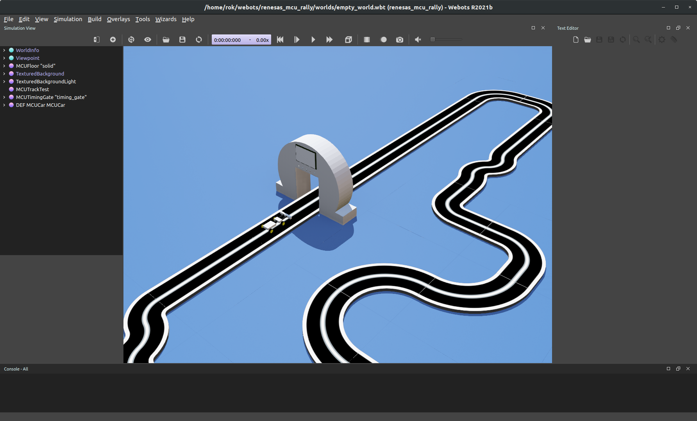
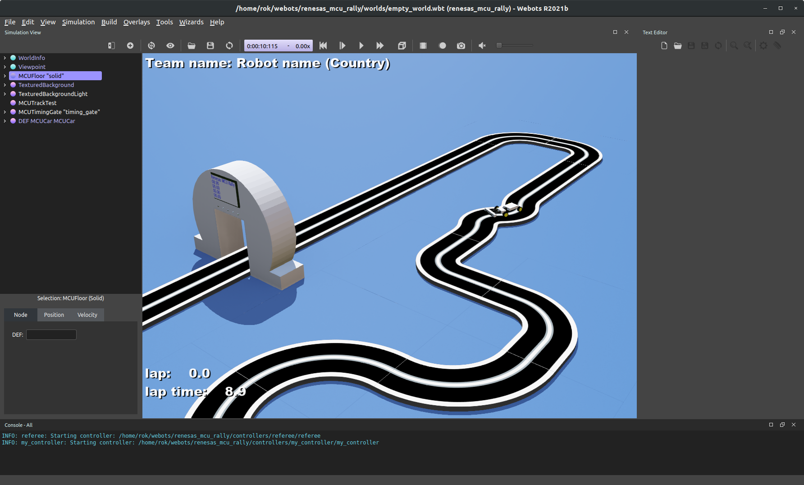

# Project setup

To set up the Renesas Virtual MCU Rally simulation from scratch:

- Open WeBots, select File -> Open World...
- Navigate to the Simulation environment folder obtained during the installation.
- Open: empty_world.wbt from the worlds folder

An empty world should appear, as shown in the following figure.

The default, empty WeBots world.

To set up your first simulation:

- assets, such as the robot and the track, need to be added, and
- the corresponding programs, called controllers, need to be compiled.

## Adding assets

Assets can be added by clicking on the (+) icon (second icon in the toolbar, shortcut Ctrl-Shift-A). The assets are added to the scene tree on the left, below the currently selected asset. Start by adding the test track.

- Pause and reset the simulation (click on the pause icon || and the rewind icon <<).
- Click on the add asset icon.
- Under PROTO nodes (Current project), select tracks->MCUTrackTest and click Add.
- Save the modified world (Save icon, shortcut Ctrl-Shift-S).

The test track is now added to the world.

Repeat the procedure to add two more assets:

- MCUTimingGate
- MCUCar

All test assets are now added to the world. Save the world before continuing.

## Compiling controllers

The next step is to compile all the programs (controllers). This includes the timing gate controller, which takes care of automated timing and refereeing, as well as the MCUCar controller. The controllers can be opened, edited, and compiled using the Text Editor on the right side of the WeBots environment. To compile the timing gate controller:

- Click on Open an existing text file icon (second icon in the Text Editor sub-window).
- Navigate to controllers -> referee -> referee.c.
- Click Build the current project (gear icon in the Text Editor)

Repeat the procedure for the safety_car_controller.c, located under controllers -> safety_car_controller and my_controller.c, located under controllers -> my_controller.

## Running the simulation

After this, the simulation can be started with the "Run the simulation in real-time" button - the play icon in the toolbar.

An example simulation is now set up.
