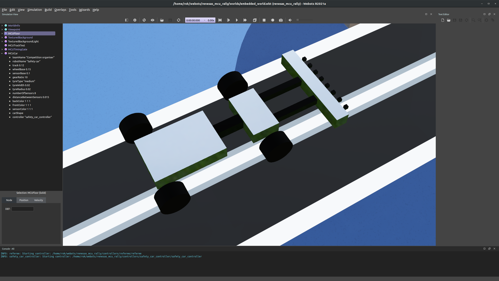
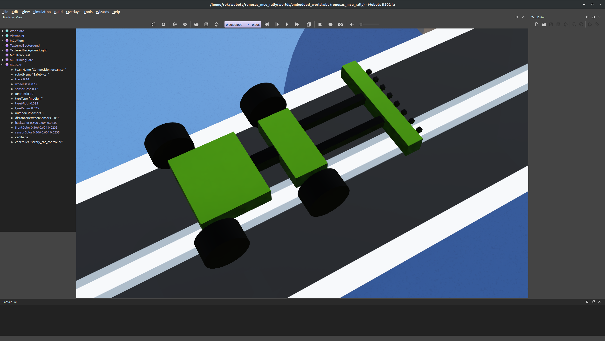

# Tuning the MCU car

## The settings

Check the parameters of the MCUCar asset and change them to see their effect. ***It is recommended to save the world and reload it after changing the settings!*** The settings include:

- wheel track (distance between left and right wheels)
- wheel base (distance between front and back wheels)
- sensor base (distance from base to sensor)
- gear ratio (motor gear ratio, higher means more torque but lower speed)
- tyre type (soft - sticky, but deteriorates fast, medium, and hard - slippy, but deteriorates slowly)
- tyre width
- tyre radius
- number of sensors
- distance between the sensors
- colors of the car parts
- car shape (3D Shapes can be added to the car to make it look better - we might have a separate competition for that ;) )
- controller (your car controller, make sure to point it to your controller program!)

Make sure to input your team name and the robot name into the corresponding fields!

## Example

Default car settings.

An example of modified car settings.
