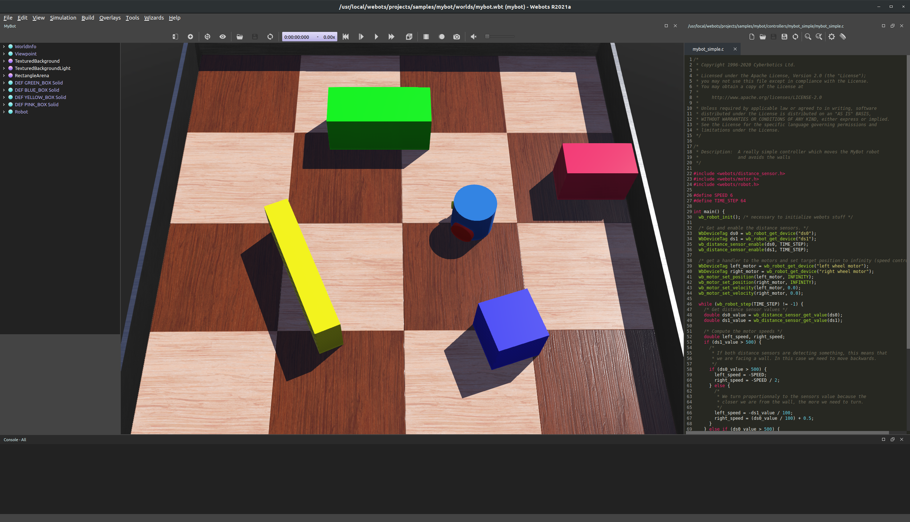

# Installing WeBots

The simulation uses the open-source [WeBots](https://cyberbotics.com/) simulation software. WeBots is a state-of-the-art robotics simulation package, selected for the competition for its rendering capabilities, precise physics simulation, extensive documentation, seamless extensibility, and cross-platform compatibility.

The first step of the installation is to install the latest version of WeBots (2022a) using the instructions, provided on WeBots website:
[https://www.cyberbotics.com/doc/guide/installation-procedure](https://www.cyberbotics.com/doc/guide/installation-procedure).

Install and run WeBots. After initial environment setup, a default simulation world should start running. Feel free to explore the sample projects under File -> Open Sample World.

A example of a WeBots simulation environment: scene tree on the left, 3D rendered scene in the middle, and the coding environment on the right.
